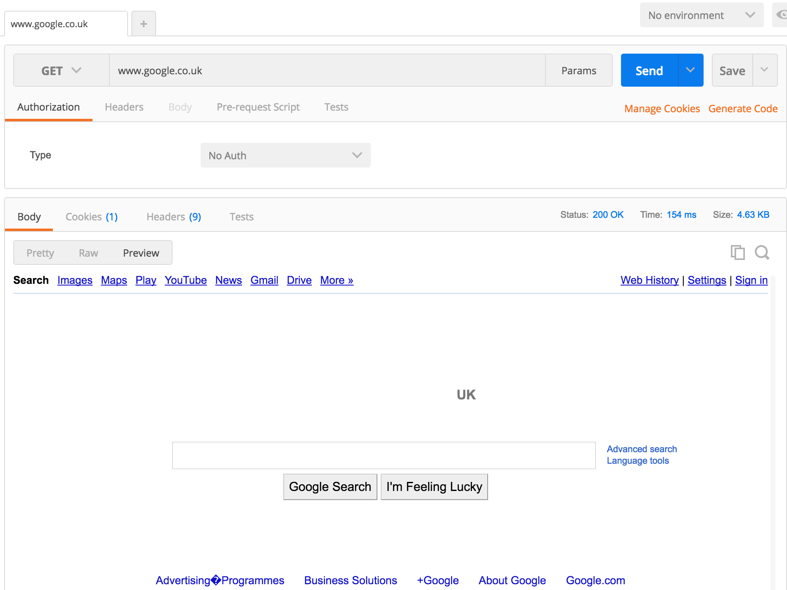
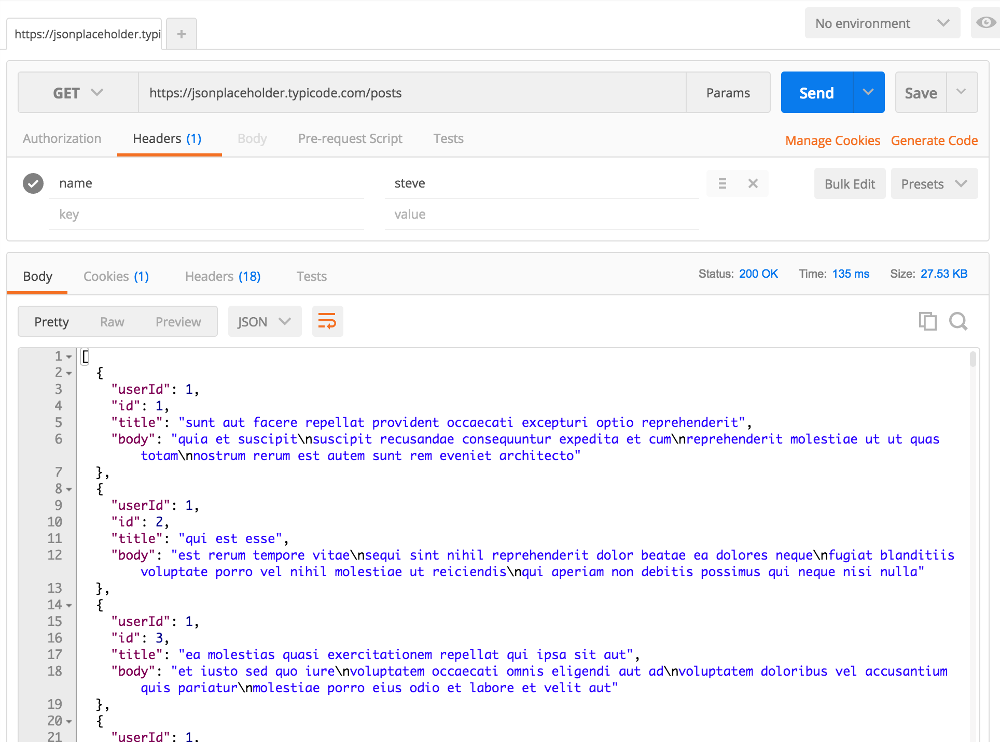
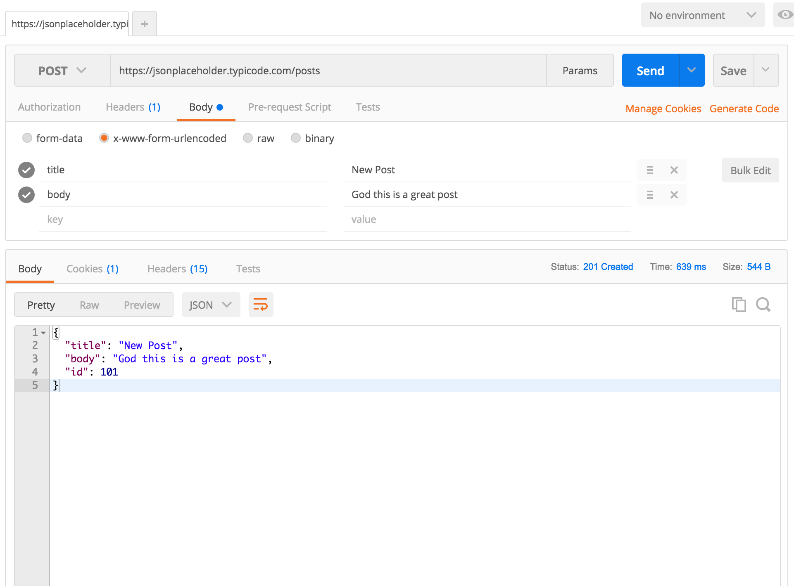

# Intro to REST and APIs

## Timings

This lesson should take between 60 and 90 minutes to complete.

## Pre-requisites

* Install postman
* How the internet works
* JSON

## This lesson covers

* APIs
* Requests
* Responses
* What is REST
* CRUD
* RESTful Routes

Let's imagine that you've built an amazing application that collects information about people's contact information. A company approaches you and asks if they can use your data to tie in to their own application and maybe create some data of their own. How would you share this information with them and how would you allow them to create new data? 

They could use the web interface that you built but that won't tie in with their mobile app very easily. HTML is actually pretty clunky for sending data because it has a visual structure attached that we don't need.

You could give them access to your database. But that has a lot of risk attached to it. We could give them a dump of the database in a file and send it over email. But that obviously has practicality issues.

The answer is to create an Application Programme Interface. This is how we decide which parts of our application people are allowed to access and how they will access it. 

We could build an API any way we like. But it would make sense if there was a standardized way to do it. That way everyone would know what to expect when they came to use it without needing to read a manual. This is where REST comes in.

Before we look at REST we need to understand a bit more of what's been going on behind the scenes.

## Postman

So far we've used a web browser to make these requests ( load web pages ). I encourage you to think of a browser as one of many programs and ways we can make requests and handle responses. Browsers are really good at requesting html, css and javascript and knowing what to do with them when it get's them. They display it and style it and allow us to interact with the result. 

There are many other programs that can make requests and they will do different things with the response. We'll be looking at one that makes more general requests for the purposes of testing called Postman.

Postman gives us much more control than a browser over the parts of a request and what to do with the response. 

You can download postman for free. So make sure you've done that now.

When you open Postman you should see at least one familiar thing. There is a bar at the top for typing a url. As we go through these examples keep Postman open so you can see the where each part lives.


## Requests

Up until now we've built web pages. I encourage you now to start thinking of html,css and javascript as types of resource that can be asked for in a request.

We make a request and we get a resource as the response then we do something with that resource. That is how you should be thinking about everything we build from now on.

When you type a url in to a web browser you are actually asking the browser to make a request. You have given it one part of what makes up a request, a url.

Let's look at all the parts that make up a request. You don't see them all in the browser because it provides them for you. But you will need to know them and what they mean as we progress.

### URL

The URL we already know. We need to tell our requesting program where to go to find the resource we want. We will build these urls to have a specific structure   which we will look at more in the REST section a bit later on.

In postman you type www.google.co.uk in to the top bar just like in your browser. Make sure the drop down to the left says GET and hit send.

You should see google loaded in the area at the bottom of the page.



### HTTP Verb

Each request will also have what's known as an HTTP Verb attached to it. There are thirteen different verbs we can send: 

```
GET
POST
PUT
PATCH
DELETE
COPY
HEAD
OPTIONS
LINK
UNLINK
PURGE
LOCK
UNLOCK
PROPFIND
VIEW
```

Luckily for us we won't use most of them. Different architectures will use these verbs differently but in REST we really only use four or five. And they should match up to specific actions:

```
GET - Show me the resource at this location
POST - Create a new resource at this location
PUT - Update or change a resource at this location
PATCH - Similar if not the same as PUT. Update a resource. There is a subtle difference but it's very rarely honoured.
DELETE - Destroy the resource at this location
```

Browsers can only send two of these verbs. GET and POST. When you type in a url and hit enter it is, by default, a GET request. If you type information in to a form and hit send it will usually send a POST request. But it can also be a GET request. This will be important in the node course.

One thing you may have noticed from this is that using the verbs means that we can send a different verb to the same url to get a different response. One may show an object for example and the other may delete it.

So a request is a combination of an HTTP Verb and a url. Both together are called a route.

When we used postman to load www.google.co.uk earlier you saw that we had a drop down to the left of the bar that had GET in it. If you click it now you should see the full list as above. 

> DISCUSSION (5 Mins) :Try changing the verb to POST and resending. What happens? Why?

Because a route is made up of a verb and a url you can't change the verb without changing the route. You should have got an error from google that said that the route POST www.google.co.uk was innapropriate. Essentially they do not have that route on their system.

Let's try the same thing with a real API rather than a website. This is an example API some nice people have made available for us to test with.

Copy the following link into your address bar in Postman and change the verb back to GET.

https://jsonplaceholder.typicode.com/posts

This time as a result you should get JSON. We'll use this from now on.

### Headers

Headers are not necessarily requried although most programs that can send requests will add some by default. They are actually quite simple. They are a place for us to send key-value pairs of data along to tell the server about our request. 

> NOTE : Key  = name , Value = value. just like in an object. E.g username = Stephen, Password = adseadad3a33

We usually use them for sending login details or tokens to a route to identify who we are. But they are used for all sorts of things.

This is really important if we want to restrict who can use our API.

In Postman you should see a tab just below the url that says 'headers'. Open that tab and you should see a place to add key value pairs. We don't need any right now. But add some to see how it works. The API should ignore them.



### Request Body

We can also send more complex data in the body of the request too. This could be an image that we're uploading, some JSON data, some simple text, some data from a form. Headers are more for configuartion but the body data is where we send the real stuff.

What you send will depend on the API and how the developers have decided to set it up.

One thing to notice is that Postman has greyed out the body area. This is because body data can only be sent with POST, PUT and PATCH verbs.

Switch to POST and open the body tab. You should see at the top some options for  how you want the form to encode the data. This is not as complex as it seems. Data can be wrapped up in a few different ways before it's sent. There are four options.

Most requests we make will be x-www-form-encoded unless we want to upload files. So select that now.

Looking at the API documentation it tells me that to create a new post we need to send two bits of info; the title and the body of the post.

So add these in to your body and hit send.




## Responses

When you make a request to server you're hoping for a response. A response can be a lot of things. But like a request it has a couple of parts. 

### HTTP Status Code

These are really simple numbered codes that get sent with the response to tell us how successfull the request was. There are tonnes of them for different purposes. 

You've very definitely all seen one status code already. When you try to load a web page that can't be found you get a 404 error. 404 is a status code that literally means "Not Found".Your browser interprets this and shows you a 404 page.

200 means "OK". Which means that you requests was successfull ( whatever it was ). 

500 means your script crashed the server. This one isn't good.

Here's a funny website with some cats ( for no reason ) that tells you what all the codes mean.

[Status Cats](https://http.cat/ "Status Cats")


> NOTE : It is up to the API developer to decide which codes they send back for what reason. Don't expect all developers to use the same codes. You may have to check out their documentation to see if they've said success was 200 or 201 etc etc.

Go back to Postman. Find where it says status on the right of the screen. You should see a 201 Status code. 201 means created. So the server is telling us that we created a resource successfully.

Win!

### Resource / Response Body

The actual data, image or thing in general that we're asking the server for is called a resource and is sent in the response body.

A resource can be absolutely any type of data just like the request body was. It could be a video, an image, some html ( like a web page ) or like in our example, a JSON representation of some data. Anything that can be sent over the internet basically.

Not all requests have to return a resource. Some will just return a 200 status code, for example, to say "I did what you asked".

In our Postman example the API didn't actually ***have*** to return us a response when we created a new resource but many APIs do. It returned us a JSON object with the data from the new object we created. You can see that in the bottom half of the screen in the body tab.

### Headers

The response will also have headers. These are the same sort of thing as the request headers. Just key-value pairs. But this time the server is sending them to us.

A very common header we will get is Content-Type.

Content-Type tells us what type of resource the server has sent. The allowed values are called MIME Types. These are just standard codes for the type of information that is being sent. The program that made the request can then say "Hey, this response is an image. Let me display that on the screen" or "This is a zip file. Let me download that for you", for example.

Here are some example MIME Types:

```
text/html - HTML
text/css - CSS
text/javascript - javascript
application/json - JSON data
application/pdf - PDF
image/jpeg - JPEG image
image/png - PNG Image
video/mp4 - MPEG 4 Video
```

Back to Postman and click on the headers tab in the bottom half of the screen this time. See if you can find the Content-Type header. What did the server tell us it sent back?

You may also notice that Postman has used this to set the format tab to JSON. 

## What is REST

REST stands for REpresentational State Transfer. It is simply a set of expectations that people will have about how your API will work and of how we will use the parts of the request and the response to communicate. Because we could use them a bunch of different ways, there's no right or wrong. REST is just one way that a bunch of people have agreed to use.

There are guidelines but no real rules to REST.

* Actions to be performed have two parts, a url and an HTTP Verb. These form a route.
* The url will have a defined structure to describe the resource you are interacting with. These are called the RESTful routes.
* Data is usually represented as JSON or XML. But most often JSON.
* Status codes are used to determine success or failure of an action

There are plenty more guidelines but these are the fundamental ones.


### CRUD

We can build our application to perform any action we think makes sense on our resources but there are some basic things that we nearly always do. 

* Create a new resource - CREATE
* Read/Show an existing resource - SHOW
* Update/Change an existing resource - UPDATE
* Delete an existing resource - DELETE
* List all the resources - INDEX

Technically List comes under READ. So CRUD is Create, Read, Update, Delete.

There's nothing codey about this. It's just a description of some common actions. You'll hear people refer to a "CRUD app" which is any app that can perform these actions on a resource. Simple.

So we'll be creating restful routes to handle each of these actions.

### Restful Routes

Each route has two parts, a verb and a url and will perform one of our crud actions. Let's imagine that we're creating an api for students. The restful routes would look like this:

| URL           | VERB      | CRUD ACTION |
|---------------|-----------|-------------|
| /students     | GET       | INDEX       |
| /students/:id | GET       | SHOW        |
| /students/:id | PUT/PATCH | UPDATE      |
| /students/:id | DELETE    | DELETE      |
| /students     | POST      | CREATE      |

You may have noticed the ``:id`` in the url. This is a common placeholder that is used in many frameworks to say that "we will need an id here". 

Here are some full examples of routes and what they might typically do in the api.

```
GET /students/1 
Get the student with id = 1

GET /students
Get a list of all the students

PUT /students/2
Update the student with id = 2 using the data sent in the body
```

You can think of the restful routes as a folder structure just like in the terminal. This means that we can even have routes that are more specific ( if we can be bothered to build them ).

Try to think about the routes as follows (even though it's not technically correct):

```
GET /students - get everything in the students folder

GET /students/1 - go in to the students folder and get number 1
```

More complex examples

```
GET /students/1/homeworks - go in to the students folder, get number 1, get all his homeworks

/GET students/1/homeworks/2 - get that students homework with id 2
```

These are called nested resources and are quite advanced. But they're good to know because they help us to understand the structure that we're trying to create.

> EXERCISE (20 Minutes) : Use postman to send requests to all 5 Restful Routes for the posts api. 


It would look something like this:
```
POST /students/1/homeworks (with some data in the request body)
```

### Two more routes

A common practise is for people to build html websites using this pattern as well. So /students would should an html list of all the students for example.

But POST and PUT request present a problem. How do users set the data that will be sent in the body? In the browser they don't have the same access to the request that we do in postman.

This is what HTML forms are for. 

We'll cover this in far more detail later on but for now you need to know that there are two more Restful Routes. One to show a form that the user can use to send a CREATE request.

And one to show a form that the user can use to send an UPDATE request.

So let's update our table with all 7 Restful Routes.

| URL                | VERB      | CRUD ACTION    |
|--------------------|-----------|----------------|
| /students          | GET       | INDEX          |
| /students/:id      | GET       | SHOW           |
| /students/:id      | PUT/PATCH | UPDATE         |
| /students/:id      | DELETE    | DELETE         |
| /students          | POST      | CREATE         |
| /students/new      | GET       | SHOW NEW FORM  |
| /students/:id/edit | GET       | SHOW EDIT FORM |

There are few things to notice about these last two routes.

* They are both GET requests. This is because they are asking to GET a form resource.
* Show edit form requires an id in the url. This makes sense because we need to know which object we're editing.
* These routes are ONLY used on HTML apps. They are totally useless in an API that returns JSON.

We will be creating our own APIs in the future at which point you will see how to make all this work. But for now it is enough to know how to use other people's apis.
 
## Summary

You just:

*  Learned that APIs are just how we allow people to interact with out system
*  Learned that Requests have a url, verb, headers and body
*  Learned that Responses have a status code, a response body and headers
*  Learned that CRUD means Create Read Update Delete and are just a collection of common actions
*  Learned that REST is just a structured way to use all of the above so that everyone is on the same page.
*  Learned the 7 Restful Routes and what they typically do


 


